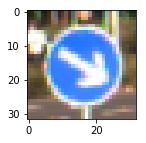
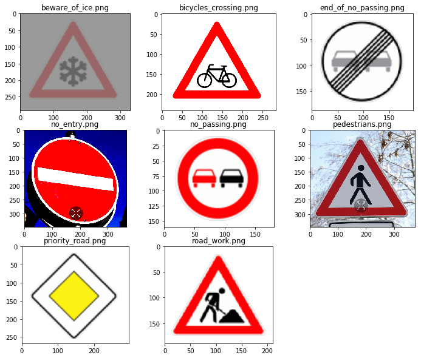
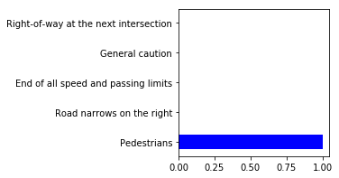

# Self-Driving Car Engineer Nanodegree

## Deep Learning

## Project: Traffic Sign Recognition Classifier

In this project I am training a deep learning model to classify traffic signs using LeNet5 architecture. The dataset used for this project is German Traffic Sign dataset. 

---
## Dataset Summary


```python
# Load pickled data
import pickle
import numpy as np

# TODO: Fill this in based on where you saved the training and testing data

training_file = "data/train.p"
validation_file = "data/valid.p"
testing_file = "data/test.p"

with open(training_file, mode='rb') as f:
    train = pickle.load(f)
with open(validation_file, mode='rb') as f:
    valid = pickle.load(f)
with open(testing_file, mode='rb') as f:
    test = pickle.load(f)
    
X_train, y_train = train['features'], train['labels']
X_valid, y_valid = valid['features'], valid['labels']
X_test, y_test = test['features'], test['labels']
```

#### Here is the collage of sample images in the dataset


```python
from PIL import Image
import random
import matplotlib.pyplot as plt

# Number of training examples
n_train = np.shape(X_train)[0]

# Number of validation examples
n_validation = np.shape(X_valid)[0]

# Number of testing examples.
n_test = np.shape(X_test)[0]

# Shape of an traffic sign image
image_shape = np.shape(X_train[0])

# Number of unique traffic signs
n_classes = len(set(y_train))

print("Number of training examples =", n_train)
print("Number of testing examples =", n_test)
print("Image data shape =", image_shape)
print("Number of classes =", n_classes)

# Display image collage

# Collage image size
coll_width = 1000
coll_height = 500
collage = Image.new('RGB', (coll_width, coll_height))

# Number of images along rows and columns in collage
rows = 5
cols = 10
thumb_width = int(coll_width/cols)
thumb_height = int(coll_height/rows)

coll_y = 0

for i in range(rows):
    coll_x = 0
    for j in range(cols):
        # Generate random index
        idx = random.randint(0, n_train)
        # Convert ndarray image to PIL Image
        img = Image.fromarray(X_train[idx])
        # Generate image thumbnail(resize)
        img = img.resize((thumb_width, thumb_height))
        # Paste the thumbnail to in the collage
        collage.paste(img, (coll_x,coll_y))
        # Update thumbnail position
        coll_x += thumb_width
        
    coll_y += thumb_height

# Display collage
%matplotlib inline
fig = plt.figure(figsize = (15,15))
out = plt.imshow(collage)
```

    Number of training examples = 34799
    Number of testing examples = 12630
    Image data shape = (32, 32, 3)
    Number of classes = 43


#### Traffic sign label for a sample image from the dataset


```python
import csv

# Read csv file to get traffic sign names
sign_names = []
with open('signnames.csv') as file:
    csvreader = csv.reader(file)
    for row in csvreader:
        sign_names.append(row[1])
        
plt.rcParams['figure.figsize'] = (2,2)

# Get random training image and print corresponding label
index = random.randint(0,n_train)
plt.imshow(X_train[index])
#print("Traffic sign index = ", y_train[index])
print("Traffic sign: ", sign_names[y_train[index]+1])
```

    Traffic sign:  Keep right





#### Histogram showing the distribution of images in training set


```python
sign_dict = dict()

for i in range(n_train):
    if(y_train[i] in sign_dict):
        sign_dict[y_train[i]] += 1
    else:
        sign_dict[y_train[i]] = 1
        
plt.rcParams['figure.figsize'] = (10,15)
fig, ax = plt.subplots()
idx = np.arange(n_classes)
width = 0.75
names = [sign_names[id+1] for id in sign_dict.keys()]
ax.barh(idx, sign_dict.values(), width, align='center', color='blue')
ax.set_yticks(idx+width/2)
bar_labels = ax.set_yticklabels(names, minor=False)
```


We can see that the training images for some of the traffic signs in quite less compared to others, so we will augment the images for these traffic signs and build a bigger dataset.

## Augment Dataset

#### Augmenting dataset with rotated images
Since the distribution of images in the training set is unequal, the trained model may not perform well on the traffic signs with less number of training samples. To overcome this problem, I augment the training dataset with rotated images till the number of training sample for each class type is atleast 2000.


```python
# Augment dataset with rotated images
import time
from tqdm import *
from scipy.ndimage.interpolation import rotate
from numpy import newaxis

# Calculate number of types each traffic sign to augment
size = 2000
sign_count_dict = dict()
for d in list(sign_dict.keys()):
    temp = size/sign_dict[d]
    if(temp > 0):
        sign_count_dict[d] = int(temp)
    else:
        sign_count_dict[d] = 0
    
X_train_aug = X_train
y_train_aug = y_train

it = len(y_train)


# For traffic sign images whose count is less than size, augment rotated images
for i in tqdm(range(it)):
    if(sign_count_dict[y_train_aug[i]] > 0):
        count = 0
        angle = 10
        while(count < sign_count_dict[y_train_aug[i]]):
            if(sign_count_dict[y_train_aug[i]] == 1):
                # Rotate image to left by angle
                rot_imgs = rotate(X_train_aug[i], angle, reshape=False)[newaxis,:,:,:]
                y_train_aug = np.append(y_train_aug, y_train_aug[i])
                count+=1
            else:
                # Rotate image to left by angle
                rot_imgs = rotate(X_train_aug[i], angle, reshape=False)[newaxis,:,:,:]
                # Rotate image to right by angle
                rot_imgs = np.concatenate((rot_imgs, rotate(X_train_aug[i],-angle,reshape=False)[newaxis,:,:,:]))
                y_train_aug = np.append(y_train_aug, y_train_aug[i])
                y_train_aug = np.append(y_train_aug, y_train_aug[i])
                count+=2
            
            # Add the rotated image to the dataset
            X_train_aug = np.concatenate((X_train_aug, rot_imgs))
            angle += 10

print("Finished augmenting dataset with rotated images")
print("Augmented training set size = ", np.shape(X_train_aug)[0])
n_train = np.shape(X_train_aug)[0]
```

    100%|██████████| 34799/34799 [48:32<00:00, 11.95it/s]  

    Finished augmenting dataset with rotated images
    Augmented training set size =  112075


    


#### Sample image from augmented dataset


```python
plt.rcParams['figure.figsize'] = (2,2)

index = 45000
plt.imshow(X_train_aug[index])
print("Traffic sign: ", sign_names[y_train_aug[index]+1])
```

    Traffic sign:  Speed limit (30km/h)


#### Histogram showing the distribution of images in the augmented training set


```python
sign_aug_dict = dict()

for i in range(len(y_train_aug)):
    if(y_train_aug[i] in sign_aug_dict):
        sign_aug_dict[y_train_aug[i]] += 1
    else:
        sign_aug_dict[y_train_aug[i]] = 1
        
%matplotlib inline
plt.rcParams['figure.figsize'] = (10,15)
fig, ax = plt.subplots()
idx = np.arange(n_classes)
width = 0.75
names = [sign_names[id+1] for id in sign_aug_dict.keys()]
ax.barh(idx, sign_aug_dict.values(), width, align='center', color='blue')
ax.set_yticks(idx+width/2)
bar_labels = ax.set_yticklabels(names, minor=False)
```


## Preprocess images

#### Normalize Dataset
The dataset is normalized by replacing each pixel value of an image with (pixel_val -128)/128. This will scale the pixel value range from 0 to 255 to -1 to +1. Normalization is done to facilitate the gradient descent algorithm to reach minimum loss for weights and bias faster. Also, normalizing the images ensures that the range of distribition of pixel value is uniform.


```python
# Normalize dataset
X_train_aug = X_train_aug.astype(np.float32)
X_train_aug = (X_train_aug - 128)/128

X_valid = X_valid.astype(np.float32)
X_valid = (X_valid - 128)/128

X_test = X_test.astype(np.float32)
X_test = (X_test - 128)/128

print("Normalized Dataset")
```

    Normalized Dataset


## Model Architecture:

The CNN model used for this classification project is a modified version of LeNet5.
LeNet5: http://yann.lecun.com/exdb/lenet/


```python
### Define your architecture here.
### Feel free to use as many code cells as needed.
from sklearn.utils import shuffle

import tensorflow as tf

# LeNet5 architecture
def lenet(x):
    # Layer 1: Convolution, input=32x32x3, output=30x30x6
    w_l1 = tf.Variable(tf.truncated_normal(shape=(3,3,3,6), mean=0.0, stddev=0.1))
    b_l1 = tf.Variable(tf.zeros(6))
    conv1 = tf.nn.conv2d(x, w_l1, strides=[1,1,1,1], padding='VALID')
    conv1 = tf.nn.bias_add(conv1, b_l1)
    conv1 = tf.nn.relu(conv1)
    
    # Layer 2: Convolution, input=30x30x6, output=28x28x12
    w_l2 = tf.Variable(tf.truncated_normal(shape=(3,3,6,12), mean=0.0, stddev=0.1))
    b_l2 = tf.Variable(tf.zeros(12))
    conv2 = tf.nn.conv2d(conv1, w_l2, strides=[1,1,1,1], padding='VALID')
    conv2 = tf.nn.bias_add(conv2, b_l2)
    conv2 = tf.nn.relu(conv2)
    
    # Layer 3: Max Pooling, input=28x28x12, output=14x14x12
    maxpool1 = tf.nn.max_pool(conv2, ksize=[1,2,2,1], strides=[1,2,2,1], padding='VALID')
    
    # Layer 4 Convolution, input=14x14x12, output=12x12x24
    w_l3 = tf.Variable(tf.truncated_normal(shape=(3,3,12,24), mean=0.0, stddev=0.1))
    b_l3 = tf.Variable(tf.zeros(24))
    conv3 = tf.nn.conv2d(maxpool1, w_l3, strides=[1,1,1,1,], padding='VALID')
    conv3 = tf.nn.bias_add(conv3, b_l3)
    conv3 = tf.nn.relu(conv3)
    
    # Layer 5: Convolution, input=12x12x24, output=10x10x48
    w_l4 = tf.Variable(tf.truncated_normal(shape=(3,3,24,48), mean=0.0, stddev=0.1))
    b_l4 = tf.Variable(tf.zeros(48))
    conv4 = tf.nn.conv2d(conv3, w_l4, strides=[1,1,1,1], padding='VALID')
    conv4 = tf.nn.bias_add(conv4, b_l4)
    conv4 = tf.nn.relu(conv4)
    
    # Layer 6: Max Pooling, input=10x10x48, output=5x5x48
    maxpool2 = tf.nn.max_pool(conv4, ksize=[1,2,2,1], strides=[1,2,2,1], padding='VALID')
    
    # Flatten output of layer 6
    x_flat = tf.contrib.layers.flatten(maxpool2)
    
    # Layer 7: Fully-connected layer, input=1200, output=600
    w_fc1 = tf.Variable(tf.truncated_normal(shape=(1200, 600), mean=0.0, stddev=0.1))
    b_fc1 = tf.Variable(tf.zeros(600))
    fc1 = tf.add(tf.matmul(x_flat, w_fc1), b_fc1)
    fc1 = tf.nn.relu(fc1)
    
    # Layer 8: Fully-connected layer, input=600, output=300
    w_fc2 = tf.Variable(tf.truncated_normal(shape=(600, 300), mean=0.0, stddev=0.1))
    b_fc2 = tf.Variable(tf.zeros(300))
    fc2 = tf.add(tf.matmul(fc1, w_fc2), b_fc2)
    fc2 = tf.nn.relu(fc2)
    
    # Layer 9: Fully-connected layer, input=300, output=150
    w_fc3 = tf.Variable(tf.truncated_normal(shape=(300,150), mean=0.0, stddev=0.1))
    b_fc3 = tf.Variable(tf.zeros(150))
    fc3 = tf.add(tf.matmul(fc2, w_fc3), b_fc3)
    fc3 = tf.nn.relu(fc3)
    
    # Layer 10: Fully-connected layer, input=150, output=75
    w_fc4 = tf.Variable(tf.truncated_normal(shape=(150,75), mean=0.0, stddev=0.1))
    b_fc4 = tf.Variable(tf.zeros(75))
    fc4 = tf.add(tf.matmul(fc3, w_fc4), b_fc4)
    fc4 = tf.nn.relu(fc4)
    
    # Layer 11: Fully-connected layer, input=75, output=n_classes
    w_fc5 = tf.Variable(tf.truncated_normal(shape=(75,n_classes), mean=0.0, stddev=0.1))
    b_fc5 = tf.Variable(tf.zeros(n_classes))
    fc5 = tf.add(tf.matmul(fc4, w_fc5), b_fc5)
    
    return fc5
```

## Train, validate and test the model

A validation set can be used to assess how well the model is performing. A low accuracy on the training and validation
sets imply underfitting. A high accuracy on the training set but low accuracy on the validation set implies overfitting.


```python
x = tf.placeholder(tf.float32, (None, 32, 32, 3))
y = tf.placeholder(tf.int32, (None))
one_hot_y = tf.one_hot(y, 43)

# Training operation
EPOCHS = 30
BATCH_SIZE = 128
learn_rate = 0.001
from sklearn.utils import shuffle
X_train_aug, y_train_aug = shuffle(X_train_aug, y_train_aug)

logits = lenet(x)
cross_entropy = tf.nn.softmax_cross_entropy_with_logits(logits=logits, labels=one_hot_y)
loss = tf.reduce_mean(cross_entropy)
optimizer = tf.train.AdamOptimizer(learning_rate=learn_rate)
training_operation = optimizer.minimize(loss)

# Validation
correct_prediction = tf.equal(tf.argmax(logits, 1), tf.argmax(one_hot_y, 1))
accuracy_operation = tf.reduce_mean(tf.cast(correct_prediction, tf.float32))
saver = tf.train.Saver()

# Function to perform evaluation
def evaluate(X_data, y_data):
    num_examples = len(y_data)
    total_accuracy = 0
    sess = tf.get_default_session()
    for offset in range(0, num_examples, BATCH_SIZE):
        X_batch, y_batch = X_data[offset:offset+BATCH_SIZE], y_data[offset:offset+BATCH_SIZE]
        accuracy = sess.run(accuracy_operation, feed_dict={x: X_batch, y: y_batch})
        total_accuracy += accuracy * len(y_batch)
    return(total_accuracy / num_examples)

# Train Model
with tf.Session() as sess:
    sess.run(tf.global_variables_initializer())
    num_examples = len(y_train_aug)
    print("Training ...")
    
    for i in range(EPOCHS):
        X_train_aug, y_train_aug = shuffle(X_train_aug, y_train_aug)
        for offset in range(0, num_examples, BATCH_SIZE):
            X_batch, y_batch = X_train_aug[offset:offset+BATCH_SIZE],y_train_aug[offset:offset+BATCH_SIZE]
            sess.run(training_operation, feed_dict={x:X_batch, y:y_batch})
        
        validation_accuracy = evaluate(X_valid, y_valid)
        print("EPOCH = ", i)
        print("Validation Accuracy = ", validation_accuracy)
        
    # Test accuracy on test set
    test_accuracy = evaluate(X_test, y_test)
    print("\nTest set accuracy = ", test_accuracy)
    
    # Save Trained model
    saver.save(sess, "./lenet/")
    print("Saved trained model")
```

    Training ...
    EPOCH =  0
    Validation Accuracy =  0.904308390293
    EPOCH =  1
    Validation Accuracy =  0.926757369615
    EPOCH =  2
    Validation Accuracy =  0.936281179409
    EPOCH =  3
    Validation Accuracy =  0.949659863946
    EPOCH =  4
    Validation Accuracy =  0.96281179114
    EPOCH =  5
    Validation Accuracy =  0.961451247436
    EPOCH =  6
    Validation Accuracy =  0.959863945659
    EPOCH =  7
    Validation Accuracy =  0.958276644261
    EPOCH =  8
    Validation Accuracy =  0.979138321995
    EPOCH =  9
    Validation Accuracy =  0.957142857413
    EPOCH =  10
    Validation Accuracy =  0.961451247166
    EPOCH =  11
    Validation Accuracy =  0.966439909297
    EPOCH =  12
    Validation Accuracy =  0.971201814059
    EPOCH =  13
    Validation Accuracy =  0.970294784337
    EPOCH =  14
    Validation Accuracy =  0.966893424307
    EPOCH =  15
    Validation Accuracy =  0.974829931973
    EPOCH =  16
    Validation Accuracy =  0.956916100071
    EPOCH =  17
    Validation Accuracy =  0.960997732426
    EPOCH =  18
    Validation Accuracy =  0.969387755102
    EPOCH =  19
    Validation Accuracy =  0.973922902494
    EPOCH =  20
    Validation Accuracy =  0.960770975057
    EPOCH =  21
    Validation Accuracy =  0.972789115646
    EPOCH =  22
    Validation Accuracy =  0.97619047619
    EPOCH =  23
    Validation Accuracy =  0.975056689342
    EPOCH =  24
    Validation Accuracy =  0.969614512472
    EPOCH =  25
    Validation Accuracy =  0.940589569161
    EPOCH =  26
    Validation Accuracy =  0.967120181406
    EPOCH =  27
    Validation Accuracy =  0.973696145125
    EPOCH =  28
    Validation Accuracy =  0.965532879819
    EPOCH =  29
    Validation Accuracy =  0.975056689342
    
    Test set accuracy =  0.964449722731
    Saved trained model


### Testing model on new images from internet

The trained model is tested on 9 German traffic sign images downloaded from interet. The images <br />
**'bicycle_crossing'** and **'no_entry'** have **high contrast and brightness**, <br />
**'beware_of_ice'** and **'pedestrians'** have **low contrast**.<br />

These variations are included to test how well the model classifies the images under different lighting conditions and camera angle.


```python
import glob
from PIL import Image

filelist = glob.glob("test/*.png")
filelist.sort()

plt.rcParams['figure.figsize'] = (12,10)
fig = plt.figure()
idx = 1

for file in filelist:
    # Load image
    img = Image.open(file)
    # Display image
    fig_sub = fig.add_subplot(3,3,idx)
    idx+=1
    fig_sub.imshow(img)
    # Display image title
    fig_sub.set_title(file[5:])
```





#### Classify new images


```python
import glob
from PIL import Image
from numpy import newaxis

filelist = glob.glob("test/*.png")
filelist.sort()

plt.rcParams['figure.figsize'] = (12,10)

predict_list = []
softmax_list = []
fig = plt.figure()
idx = 1
print("Traffic Sign Classification")

with tf.Session() as sess:
    saver.restore(sess, "./lenet/")
    # Load new images and lables
    for file in filelist:
        # Load image
        img = Image.open(file)
        # Display image
        fig_sub = fig.add_subplot(3,3, idx)
        idx += 1
        fig_sub.imshow(img)
        # Resize image
        img = img.resize((32,32))
        # Convert image to ndarray
        img = np.array(img, dtype='float32')
        # Normalize image
        img = (img - 128) / 128
        # Add new dimension to ndarray
        img = img[newaxis, :, :, :]
        # Run prediction
        predict_value = sess.run(tf.argmax(logits,1), feed_dict={x:img})
        softmax_value = sess.run(tf.nn.softmax(logits), feed_dict={x:img})
        predict_list.append(predict_value)
        softmax_list.append(softmax_value)
        # Print sign name
        fig_sub.set_title(sign_names[int(predict_value+1)])

plt.tight_layout()
```

    Traffic Sign Classification


#### Performance analysis


```python
# Label numbers for the test images
y_newimages = [30, 29, 41, 17, 9, 27, 12, 25]

num_images = len(y_newimages)
correct_predict = 0

for i in range(len(predict_list)):
    if(y_newimages[i] == predict_list[i]):
        correct_predict+=1
        
print("Prediction accuracy of test images = ", (float(correct_predict)/num_images)*100, "%")
```

    Prediction accuracy of test images =  87.5 %


#### Remarks:
The model labelled 7 out of 8 traffic signs accurately. The validation-set accuracy is 97.5% and the test-set accuracy is 96.44%. It seems like the model is overfitting, addition of droupout layers could resolve this problem. 

## Further analysis of model

### Top 5 softmax probabilities for test images from internet


```python
plt.rcParams['figure.figsize'] = (3,3)

width = 0.5

with tf.Session() as sess:
    for softmax in softmax_list:
        values_list, indices_list = sess.run(tf.nn.top_k(tf.constant(softmax), k=5))
        values = values_list[0]
        indices = indices_list[0]
        names = [sign_names[id+1] for id in indices]
        names = [" "] + names
        idx = np.arange(len(indices))
        fig, ax = plt.subplots()
        ax.barh(idx, values, width, align='center', color='blue')
        ax.set_yticklabels(names, minor=False)
                
        
```





### Remarks

From the top 5 softmax probabilites for each image, we can say that the model is very certain about the predicted labels. Except for the first image, the model is almost 100% certain about the predicted labels. For the first image, **'beware_of_ice/snow'**, the model is about **85%** certain that the image is of **'beware of ice/snow'**. It's around **10%** certain that the image is of **'Right-of-way at the next intersection'**.
